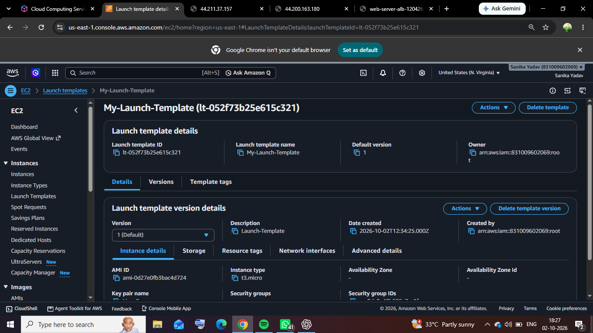
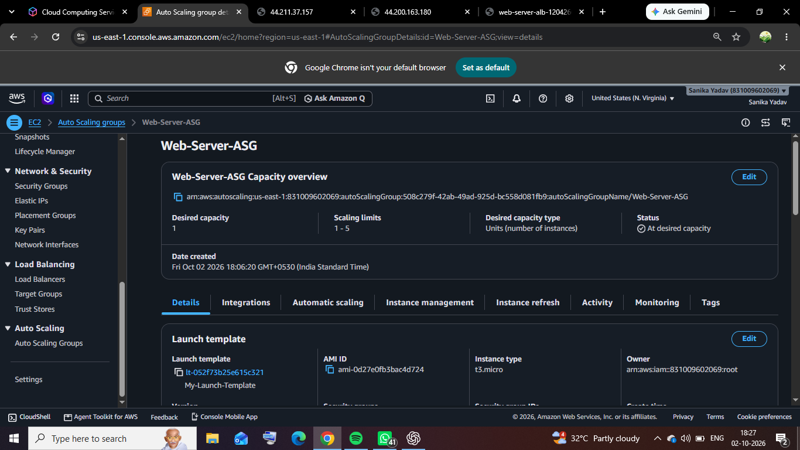
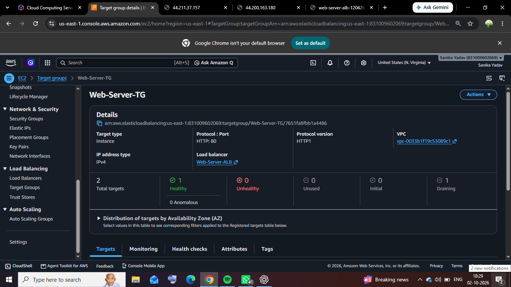
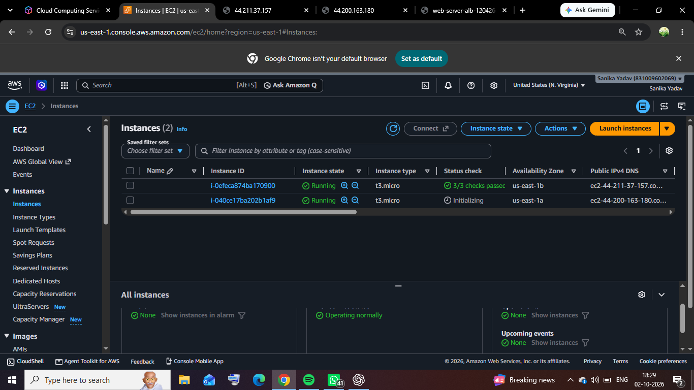
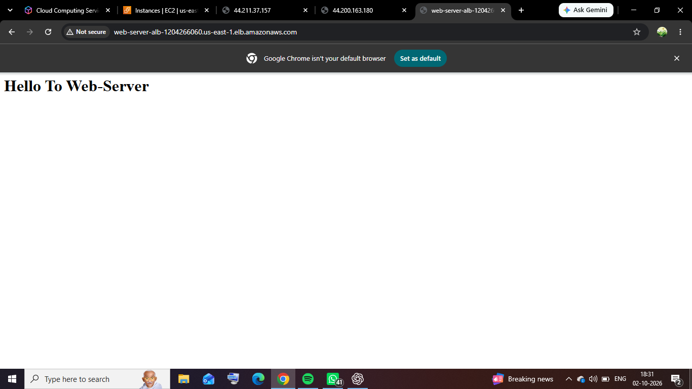
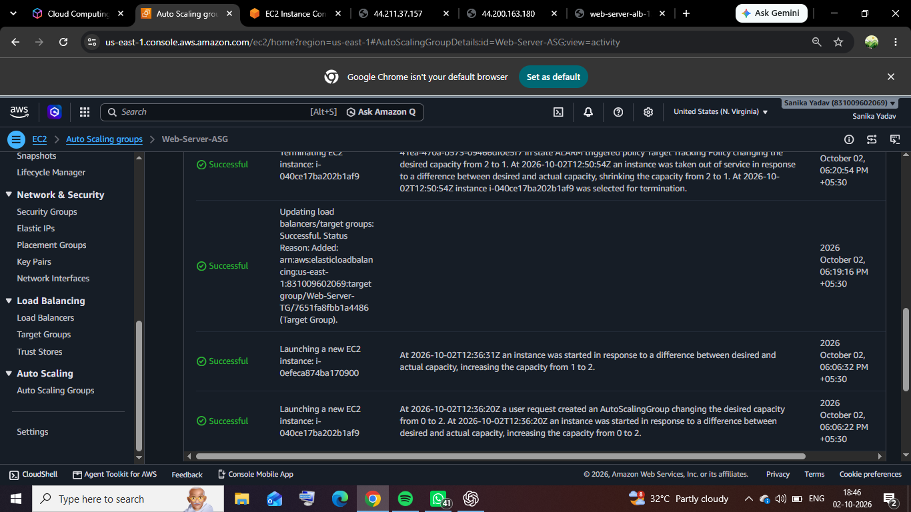

# Q3 – EC2 Auto Scaling Web Server

## AWS Project Assignment – Set 2

**Objective:** Configure an EC2 Auto Scaling Group (ASG) that automatically launches and terminates EC2 instances based on CPU utilization, with an Application Load Balancer (ALB), Target Group, Launch Template, Nginx and CloudWatch Target Tracking.

---

## 1. Project Overview

This project demonstrates the configuration of an EC2 Auto Scaling Group for a web application.

A Launch Template provides the configuration for EC2 instances. The instances run Nginx as the web server. An Application Load Balancer distributes incoming traffic through a Target Group. A Target Tracking scaling policy maintains average CPU utilization at 50% and automatically adjusts the number of EC2 instances when required.

---

## 2. Architecture

**Internet → Application Load Balancer → Target Group → Auto Scaling Group → EC2 Instances → Nginx**

The Auto Scaling Group manages the EC2 instances. Instances launched by the ASG are automatically registered with the Target Group. The ALB forwards incoming requests to healthy instances.

---

## 3. Launch Template

A Launch Template was created to define the configuration of the EC2 instances launched by the Auto Scaling Group.

### Configuration

- **Launch Template:** My-Launch-Template
- **Operating System:** Amazon Linux 2023
- **Instance Type:** t3.micro
- **Key Pair:** LinuxServer
- **Storage:** 8 GiB gp3
- **Web Server:** Nginx
- **User Data:** Used to automatically install and start Nginx

### Screenshot 1 – Launch Template

*Figure 1 – Launch Template configuration*

---

## 4. Auto Scaling Group

An Auto Scaling Group was created using the Launch Template.

### Configuration

- **Auto Scaling Group:** Web-Server-ASG
- **Launch Template:** My-Launch-Template
- **Minimum capacity:** 1
- **Desired capacity:** 2
- **Maximum capacity:** 5

The ASG automatically maintains the desired number of EC2 instances and can increase or decrease capacity according to the configured scaling policy.

### Screenshot 2 – Auto Scaling Group

*Figure 2 – Auto Scaling Group configuration*

---

## 5. Target Group

A Target Group was created for the web servers.

### Configuration

- **Target type:** Instances
- **Protocol:** HTTP
- **Port:** 80
- **Health check path:** `/`
- **Target Group:** Web-Server-TG

The Target Group was associated with the Application Load Balancer and Auto Scaling Group. The ASG automatically registers instances that it launches.

### Screenshot 3 – Target Group

*Figure 3 – Target Group configuration*

---

## 6. Instances at Desired Capacity

After creating the Auto Scaling Group, EC2 instances were launched automatically according to the desired capacity.

The initial desired capacity was **2**, and the required instances were running successfully.

### Screenshot 4 – Running Instances

*Figure 4 – EC2 instances running at the desired capacity*

---

## 7. Application Load Balancer Testing

The Application Load Balancer was configured to forward HTTP traffic to the Target Group.

The application was tested using the ALB DNS name and the Nginx web page was successfully displayed.

### Screenshot 5 – Website Through ALB

*Figure 5 – Web server running through the Application Load Balancer DNS*

---

## 8. Target Tracking Scaling Policy

A Target Tracking scaling policy was configured for the Auto Scaling Group.

### Policy Configuration

- **Policy type:** Target Tracking
- **Metric:** Average CPU Utilization
- **Target value:** 50%
- **Capacity adjustment:** Automatically add or remove capacity
- **Instance warm-up:** 300 seconds

The policy uses CloudWatch CPU utilization information to determine when the Auto Scaling Group should change its capacity.

---

## 9. Scale-Out Test

To demonstrate automatic scaling, CPU load was generated on an EC2 instance.

The Target Tracking policy detected the increased CPU utilization through CloudWatch and automatically launched a new EC2 instance.

The Auto Scaling Group increased its capacity from **1 to 2** during the test.

### Screenshot 6 – Automatic Scale-Out

*Figure 6 – New EC2 instance launched automatically after the CPU stress test*

---

## 10. Auto Scaling Activity History

The Auto Scaling Activity History recorded the scaling operation.

The activity history showed that a Target Tracking CloudWatch alarm entered the **ALARM** state and triggered the Target Tracking policy. The policy changed the desired capacity and an EC2 instance was launched automatically.

The Activity History also recorded an earlier scale-in event where the desired capacity changed from **2 to 1** after CPU utilization decreased.

This demonstrates both:

- **Scale-out:** 1 → 2
- **Scale-in:** 2 → 1

### Screenshot 7 – ASG Activity History

*Figure 7 – Auto Scaling Activity History showing automatic scaling actions*

---

## 11. Testing Results

| Test | Expected Result | Result |
|---|---|---|
| Launch Template | Provides EC2 configuration | Successful |
| Auto Scaling Group | Launches required instances | Successful |
| Target Group | Receives ASG instances and performs health checks | Successful |
| ALB DNS | Web application is accessible | Successful |
| CPU stress test | CPU utilization increases | Successful |
| Scale-out | ASG automatically launches a new EC2 instance | Successful |
| Scale-in | ASG automatically reduces capacity when CPU decreases | Successful |
| Activity History | Scaling actions are recorded | Successful |

---

## 12. Conclusion

The EC2 Auto Scaling web server was successfully configured using AWS Launch Template, Auto Scaling Group, Application Load Balancer, Target Group, Nginx and CloudWatch Target Tracking.

The project successfully demonstrated:

- Automatic EC2 instance provisioning
- Auto Scaling Group capacity management
- Target Group health checks
- Application Load Balancer traffic routing
- Web application access through ALB DNS
- CPU-based automatic scale-out
- CPU-based automatic scale-in
- CloudWatch Target Tracking integration
- Auto Scaling Activity History

The scaling test confirmed that the Auto Scaling Group can automatically adjust EC2 capacity based on CPU utilization.
